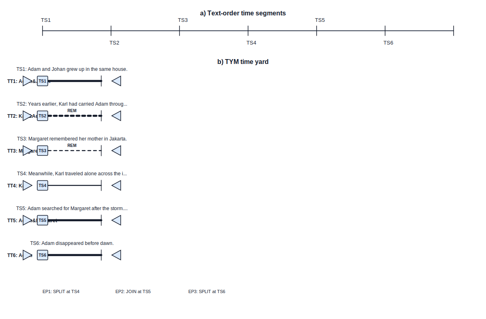

# TYM .NET API Prototype

TYM is a small ASP.NET Core Minimal API for turning narrative text into time-yard diagrams. It is based on the time-yard model from Cristea and Macovei: a text is represented as time tracks (`TT`), time segments (`TS`), endpoints, and temporal relations. The generated SVG mirrors the example image by showing:

- a text-order segment chain, where `TS` items appear in reading order
- a time-yard view, where segments are arranged by narrative tracks
- start/stop markers, joins/splits, rupture/commute hints, and segment labels

This prototype now follows the implementation directions from the supplied papers more closely. It first extracts event-like clauses, attaches actors, temporal anchors, locations, actions, and a `Past`/`Present`/`Future` temporal category, then groups contiguous compatible events into time segments. ML.NET is used for event temporal-category classification and for each candidate time segment's narrative type (`NAR`, `REM`, `SUP`, `GEN`, or `FIC`). The bundled models are trained at startup from seed examples in `Program.cs`; a production implementation should replace those examples with the annotated TYM corpus.

No LLM is used by the API pipeline. The extraction path is deterministic rules plus ML.NET classifiers, and the renderer is deterministic JSON/SVG/XML generation. The JSON/XML output now also includes a TimeML-style layer with `EVENT`, `TIMEX3`, `SIGNAL`, `MAKEINSTANCE`, and `TLINK` annotations so the TYM diagram can be compared with standard temporal NLP tooling.

English is the default extraction language. Romanian narrative text is supported with `options.language = "ro"` using Romanian rule profiles for named-entity candidates, temporal anchors, temporal signals, event tense, TimeML-style labels, and TYM segment/track creation.

## Example

Input text:

> Adam and Johan grew up in the same house. Years earlier, Karl had carried Adam through the rain. Margaret remembered her mother in Jakarta. Meanwhile, Karl traveled alone across the island. Adam searched for Margaret after the storm. Margaret found Adam at the doorway. Adam disappeared before dawn.

Generated diagram:



The generated SVG includes a legend for solid lines, dotted lines, track start/stop triangles, segment boxes, boundary ticks, and inferred JOIN/SPLIT endpoint labels.

## Minimal React UI

Live UI:

[https://tymui20260707serban.z13.web.core.windows.net](https://tymui20260707serban.z13.web.core.windows.net)

Container App UI:

[https://tym-ui-serban.livelyrock-2726c024.eastus.azurecontainerapps.io](https://tym-ui-serban.livelyrock-2726c024.eastus.azurecontainerapps.io)

Live API:

[https://tym-api-serban.livelyrock-2726c024.eastus.azurecontainerapps.io](https://tym-api-serban.livelyrock-2726c024.eastus.azurecontainerapps.io)

The UI is in [ui/Tym.Ui](ui/Tym.Ui). It serves a minimal React page with English and Romanian examples, calls `POST /v1/diagrams`, displays extraction counts, renders the returned SVG, supports fit/zoom inspection, exposes TimeML/JSON/XML result tabs, and can download SVG/JSON/XML outputs.

## Run

```powershell
cd tym-api
dotnet run --urls http://127.0.0.1:8765
```

Then call:

```powershell
Invoke-RestMethod `
  -Uri http://127.0.0.1:8765/v1/diagrams `
  -Method Post `
  -ContentType 'application/json' `
  -Body (Get-Content .\sample_input.json -Raw)
```

Romanian sample:

```powershell
Invoke-RestMethod `
  -Uri http://127.0.0.1:8765/v1/diagrams `
  -Method Post `
  -ContentType 'application/json' `
  -Body (Get-Content .\sample_input_ro.json -Raw)
```

To get only SVG:

```powershell
Invoke-WebRequest `
  -Uri http://127.0.0.1:8765/v1/diagrams/svg `
  -Method Post `
  -ContentType 'application/json' `
  -Body (Get-Content .\sample_input.json -Raw) `
  -OutFile .\sample_output.svg
```

Run the UI locally against the Azure API:

```powershell
dotnet run --project .\ui\Tym.Ui\Tym.Ui.csproj --urls http://127.0.0.1:8780
```

Run the UI locally against a local API:

```powershell
$env:TYM_API_BASE_URL='http://127.0.0.1:8765'
dotnet run --project .\ui\Tym.Ui\Tym.Ui.csproj --urls http://127.0.0.1:8780
```

## Endpoints

- `GET /health`
- `GET /` returns service metadata and the available endpoints
- `POST /v1/diagrams` returns normalized diagram JSON plus embedded SVG
- `POST /v1/diagrams/svg` returns `image/svg+xml`
- `POST /v1/diagrams/xml` returns paper-style XML notation

See [openapi.yaml](openapi.yaml) for the full contract.

The API also serves the contract at:

```text
http://127.0.0.1:8765/openapi.yaml
```

## Core Data Model

`NarrativeEvent` is the event-level unit suggested by the second paper:

- `id`: stable event id, such as `EV1`
- `actors`: person entities participating in the event, with carry-forward when absent
- `temporal_anchor`: detected temporal expression or inherited anchor
- `location`: lightweight location phrase
- `action`: detected verb/action cue
- `temporal_category`: `Past`, `Present`, or `Future`
- `span_start`, `span_end`: source character offsets

`TimeSegment` corresponds to `TS` in the paper:

- `id`: stable segment id, such as `TS1`
- `text`: source span
- `track_id`: owning time track
- `type`: `NAR`, `REM`, `SUP`, `GEN`, or `FIC`
- `perspective`: narrator, character, or unknown
- `text_order`: source order index
- `story_order`: layout order inside the track
- `actors`: stable character set for the segment
- `location_id`: associated `TL` location id
- `temporal_anchor`: associated temporal expression
- `temporal_category`: `Past`, `Present`, or `Future`
- `event_ids`: events grouped into this segment
- `confidence`: ML.NET classifier confidence for `type`
- `classifier`: `mlnet_seed_model` or `heuristic_fallback`

For Romanian (`language = "ro"`), event temporal category and segment type are currently rule-based (`romanian_rule_event_temporal`, `romanian_rule_segment_type`) because the bundled ML.NET seed examples are English.

`TimeTrack` corresponds to `TT`:

- `id`: stable track id, such as `TT1`
- `name`: mnemonic track name, usually inferred from character entities
- `left_endpoint`: `START` or split endpoint id
- `right_endpoint`: `STOP` or join endpoint id

`Endpoint` captures joins and splits:

- `type`: `JOIN` or `SPLIT`
- `track_ids`: the involved tracks
- `segment_id`: the segment where the event is inferred

`TimeRelation` captures shallow temporal constraints:

- `from_id`, `to_id`
- `rel`: `BEFORE`, `IMMEDIATELY_BEFORE`, `AFTER`, `IMMEDIATELY_AFTER`, or `SIMULTANEOUS`
- `cue`, `evidence`: the lexical cue and rule explanation, when available

`time_ml` is a TimeML-style annotation layer:

- `events`: event heads with TimeML event class, such as `OCCURRENCE`, `STATE`, `I_STATE`, or `PERCEPTION`
- `timex3`: temporal expressions with rough `DATE`, `TIME`, `DURATION`, or `SET` typing and normalized values such as `PAST_REF`
- `signals`: cue words such as `meanwhile`, `years earlier`, `then`, or `after`
- `make_instances`: event instances with tense, aspect, polarity, and POS
- `tlinks`: event-event and event-time temporal links using TimeML-style relation labels such as `IBEFORE`, `BEFORE`, `SIMULTANEOUS`, and `IS_INCLUDED`

## Production Notes

The API boundary is intentionally separate from extraction. The current pipeline is:

1. split text into event-like clauses using punctuation, conjunction, and verb cues
2. extract actor, temporal anchor, location, action, and offset features
3. classify each event as `Past`, `Present`, or `Future` with ML.NET for English, or Romanian temporal rules for Romanian
4. concatenate adjacent events with compatible temporal category and actor unity into `TS`
5. classify each `TS` as `NAR`, `REM`, `SUP`, `GEN`, or `FIC` with ML.NET for English, or Romanian narrative-mode rules for Romanian
6. infer TT membership, boundaries, endpoints, and relations
7. emit TimeML-style EVENT/TIMEX3/SIGNAL/MAKEINSTANCE/TLINK annotations
8. render JSON, SVG, and paper-style XML

The renderer consumes normalized TYM JSON, so extraction can be upgraded independently.

## Non-LLM Framework POCs

The comparison suite in [pocs/nlp-framework-comparison](pocs/nlp-framework-comparison) implements the article pipeline as non-LLM proof of concepts and reports statistics for:

- article-guided rules
- spaCy NER/POS/dependency preprocessing
- Stanza NER/POS/dependency preprocessing
- SUTime/CoreNLP availability
- HeidelTime availability
- current saved .NET API output

See [poc_report.md](pocs/nlp-framework-comparison/results/poc_report.md) for the generated statistics and [llm_considerations.md](pocs/nlp-framework-comparison/llm_considerations.md) for where an optional LLM layer would fit.
