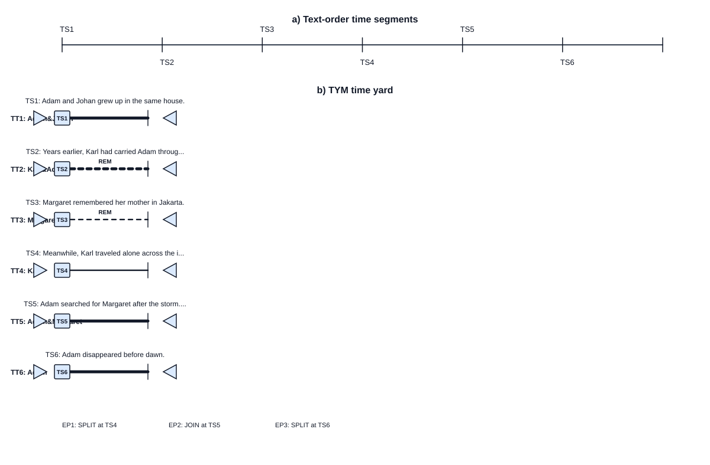

# TYM .NET API Prototype

TYM is a small ASP.NET Core Minimal API for turning narrative text into time-yard diagrams. It is based on the time-yard model from Cristea and Macovei: a text is represented as time tracks (`TT`), time segments (`TS`), endpoints, and temporal relations. The generated SVG mirrors the example image by showing:

- a text-order segment chain, where `TS` items appear in reading order
- a time-yard view, where segments are arranged by narrative tracks
- start/stop markers, joins/splits, rupture/commute hints, and segment labels

This prototype implements an interpretable baseline for the updated TYM paper. It extracts event-like clauses, attaches actors, temporal anchors, locations, actions, and a `Past`/`Present`/`Future` temporal category, then groups contiguous compatible events into time segments. ML.NET classifies event temporal categories and candidate segment narrative types (`NAR`, `REM`, `SUP`, `GEN`, or `FIC`). By default the API trains its seed baseline from [data/seed-examples.jsonl](data/seed-examples.jsonl); it can instead load explicitly trained English ML.NET artifacts. Neither model is the CNN evaluated in the paper, and neither should be described as trained on the paper's annotated TYM corpus unless that corpus was actually used.

No transformer or LLM is used by the API pipeline. Extraction uses deterministic rules plus ML.NET seed or saved classifiers, and rendering is deterministic JSON/SVG/XML generation. Event JSON and XML include per-attribute provenance for actors, temporal anchors, locations, actions, temporal categories, and relations. This marks explicit pattern matches, previous-event carry-forward, model/rule classifications, text-order defaults, and missing values so inferred information can be audited. The JSON/XML output also includes a TimeML-style layer with `EVENT`, `TIMEX3`, `SIGNAL`, `MAKEINSTANCE`, and `TLINK` annotations. Each response's `analysis` object reports extractor counts, confidence averages, provenance source counts, and quality issues.

English is the default extraction language. Romanian narrative text is supported with `options.language = "ro"` using Romanian rule profiles for named-entity candidates, temporal anchors, temporal signals, event tense, TimeML-style labels, and TYM segment/track creation. Both languages use the paper's single-author perspective baseline (`author`/`autor`); speaker attribution, focalization changes, and coreference resolution remain future work. When an actor is absent, the current heuristic carries forward the previous event's actor set and marks that choice in provenance.

## Alignment with the Updated Paper

The paper reports its original CNN baseline on 2,000 extracted events: 58.9% accuracy and approximately 58.7% macro F1, producing 93 time segments. Those are paper results; they are not results from this API's ML.NET seed classifiers or the small framework POCs in this repository. The POCs report component availability, counts, and runtime for a few sample texts, not model-quality metrics.

The current API implements the transparent rules/seed-model baseline and auditable provenance. Transformer event representations, sequence-based TS boundary detection, pairwise temporal-relation models, schema-constrained LLM extraction, and human correction remain proposed work. The ML.NET modeling CLI now trains saved classifiers and evaluates supplied adjudicated data with grouped splits; because this repo contains no human TYM corpus, it establishes no model-quality results by itself. See [AGENTS.md](AGENTS.md) for project contribution and evaluation conventions.

## Training data and evaluation

The checked-in seed examples are explicitly marked synthetic and unreviewed. They can be used to exercise training code; they are not a gold set or evidence of model quality. Keep corpus annotations private unless their license and privacy terms allow publication. The [data README](data/README.md) describes the data fields, and the [ML.NET training/evaluation guide](pocs/model-evaluation/README.md) documents chapter/document-grouped evaluation, synthetic training controls, and unlabeled clustering. It includes no corpus data or precomputed accuracy claims.

The [2027 corpus and synthetic-data plan](docs/research/2027-corpus-and-synthetic-data-plan.md) separates target-domain human gold, public comparator corpora, and unlabeled discovery data. It maps distinct corpus/training questions to EACL, COLING, NAACL, ACL, and EMNLP audiences. The [annotation pilot note](docs/research/ro-timebank-and-annotation-pilot.md) documents the newly supplied Romanian/English TYM XML pair, the separate ISO-TimeML role of Ro-TimeBank, and the limits of training from one parallel story. The [master project prompt](docs/research/MASTER_PROJECT_PROMPT.md) consolidates the requested research, engineering, UI, presentation, and delivery goals. The [PowerPoint roadmap](docs/research/TYM_MLNET_Synthetic_Research_Roadmap_2027_RoTimeBank_Annotation_Pilot.pptx) presents the updated research plan. These are research proposals and pilot artifacts; they do not claim a held-out score or a state-of-the-art result.

## Example

Input text:

> Adam and Johan grew up in the same house. Years earlier, Karl had carried Adam through the rain. Margaret remembered her mother in Jakarta. Meanwhile, Karl traveled alone across the island. Adam searched for Margaret after the storm. Margaret found Adam at the doorway. Adam disappeared before dawn.

Generated diagram:



The generated SVG includes a legend for solid lines, dotted lines, track start/stop triangles, segment boxes, boundary ticks, and inferred JOIN/SPLIT endpoint labels.

## Minimal React UI

Live UI:

[https://tymui20260707serban.z13.web.core.windows.net](https://tymui20260707serban.z13.web.core.windows.net)

Container App UI:

[https://tym-ui-serban.livelyrock-2726c024.eastus.azurecontainerapps.io](https://tym-ui-serban.livelyrock-2726c024.eastus.azurecontainerapps.io)

Live API:

[https://tym-api-serban.livelyrock-2726c024.eastus.azurecontainerapps.io](https://tym-api-serban.livelyrock-2726c024.eastus.azurecontainerapps.io)

The UI is in [ui/Tym.Ui](ui/Tym.Ui). It serves a minimal React page with English and Romanian examples, calls `POST /v1/diagrams`, displays extraction counts and event-level provenance, renders the returned SVG, supports fit/zoom inspection, exposes Analysis/TimeML/JSON/XML result tabs, and can download SVG/JSON/XML outputs.

## Run

```powershell
cd tym-api
dotnet run --urls http://127.0.0.1:8765
```

Then call:

```powershell
Invoke-RestMethod `
  -Uri http://127.0.0.1:8765/v1/diagrams `
  -Method Post `
  -ContentType 'application/json' `
  -Body (Get-Content .\sample_input.json -Raw)
```

Romanian sample:

```powershell
Invoke-RestMethod `
  -Uri http://127.0.0.1:8765/v1/diagrams `
  -Method Post `
  -ContentType 'application/json' `
  -Body (Get-Content .\sample_input_ro.json -Raw)
```

To get only SVG:

```powershell
Invoke-WebRequest `
  -Uri http://127.0.0.1:8765/v1/diagrams/svg `
  -Method Post `
  -ContentType 'application/json' `
  -Body (Get-Content .\sample_input.json -Raw) `
  -OutFile .\sample_output.svg
```

Run the UI locally against the Azure API:

```powershell
dotnet run --project .\ui\Tym.Ui\Tym.Ui.csproj --urls http://127.0.0.1:8780
```

Run the UI locally against a local API:

```powershell
$env:TYM_API_BASE_URL='http://127.0.0.1:8765'
dotnet run --project .\ui\Tym.Ui\Tym.Ui.csproj --urls http://127.0.0.1:8780
```

## Endpoints

- `GET /health`
- `GET /v1/models` lists corpus classifiers and training provenance when `TYM_CORPUS_MODEL_DIR` is configured
- `POST /v1/predictions` accepts `model_id` and `text` and returns one exploratory model label
- `GET /` returns service metadata and the available endpoints
- `POST /v1/diagrams` returns normalized diagram JSON plus embedded SVG
- `POST /v1/diagrams/svg` returns `image/svg+xml`
- `POST /v1/diagrams/xml` returns paper-style XML notation

See [openapi.yaml](openapi.yaml) for the full contract.

The API also serves the contract at:

```text
http://127.0.0.1:8765/openapi.yaml
```

## Core Data Model

`NarrativeEvent` is the event-level unit described in the updated paper:

- `id`: stable event id, such as `EV1`
- `actors`: person entities participating in the event, with carry-forward when absent
- `temporal_anchor`: detected temporal expression or inherited anchor
- `location`: lightweight location phrase
- `action`: detected verb/action cue
- `temporal_category`: `Past`, `Present`, or `Future`
- `span_start`, `span_end`: source character offsets
- `provenance`: per-attribute `source` and `evidence` for actors, temporal anchors, locations, actions, temporal categories, and relations

`TimeSegment` corresponds to `TS` in the paper:

- `id`: stable segment id, such as `TS1`
- `text`: source span
- `track_id`: owning time track
- `type`: `NAR`, `REM`, `SUP`, `GEN`, or `FIC`
- `perspective`: `author` (English) or `autor` (Romanian), following the paper's single-author baseline
- `text_order`: source order index
- `story_order`: layout order inside the track
- `actors`: stable character set for the segment
- `location_id`: associated `TL` location id
- `temporal_anchor`: associated temporal expression
- `temporal_category`: `Past`, `Present`, or `Future`
- `event_ids`: events grouped into this segment
- `confidence`: ML.NET classifier confidence for `type`
- `classifier`: a seed model (for example `mlnet_seed_model`), a saved model (`mlnet_trained_model`), or a heuristic fallback

For Romanian (`language = "ro"`), event temporal category and segment type are currently rule-based (`romanian_rule_event_temporal`, `romanian_rule_segment_type`) because the bundled ML.NET seed examples are English.

`TimeTrack` corresponds to `TT`:

- `id`: stable track id, such as `TT1`
- `name`: mnemonic track name, usually inferred from character entities
- `left_endpoint`: `START` or split endpoint id
- `right_endpoint`: `STOP` or join endpoint id

`Endpoint` captures joins and splits:

- `type`: `JOIN` or `SPLIT`
- `track_ids`: the involved tracks
- `segment_id`: the segment where the event is inferred

`TimeRelation` captures shallow temporal constraints:

- `from_id`, `to_id`
- `rel`: `BEFORE`, `IMMEDIATELY_BEFORE`, `AFTER`, `IMMEDIATELY_AFTER`, or `SIMULTANEOUS`
- `cue`, `evidence`: the lexical cue and rule explanation, when available

`time_ml` is a TimeML-style annotation layer:

- `events`: event heads with TimeML event class, such as `OCCURRENCE`, `STATE`, `I_STATE`, or `PERCEPTION`
- `timex3`: temporal expressions with rough `DATE`, `TIME`, `DURATION`, or `SET` typing and normalized values such as `PAST_REF`
- `signals`: cue words such as `meanwhile`, `years earlier`, `then`, or `after`
- `make_instances`: event instances with tense, aspect, polarity, and POS
- `tlinks`: event-event and event-time temporal links using TimeML-style relation labels such as `IBEFORE`, `BEFORE`, `SIMULTANEOUS`, and `IS_INCLUDED`

`analysis.provenance_sources` counts the methods attached to event attributes. The source names distinguish explicit pattern extraction, carry-forward heuristics, classifier/rule outputs, text-order defaults, and unavailable values.

## Production Notes

The API boundary is intentionally separate from extraction. The current pipeline is:

1. split text into event-like clauses using punctuation, conjunction, and verb cues
2. extract actor, temporal anchor, location, action, and offset features
3. classify each event as `Past`, `Present`, or `Future` with ML.NET for English, or Romanian temporal rules for Romanian
4. concatenate adjacent events with compatible temporal category and actor unity into `TS`, while forcing a new segment when explicit retrospective, forward, simultaneous, or changed-anchor cues indicate a temporal boundary
5. classify each `TS` as `NAR`, `REM`, `SUP`, `GEN`, or `FIC` with the ML.NET saved model or seed fallback for English, or Romanian narrative-mode rules for Romanian
6. infer TT membership, boundaries, endpoints, and relations
7. emit TimeML-style EVENT/TIMEX3/SIGNAL/MAKEINSTANCE/TLINK annotations
8. emit analysis statistics and quality issues
9. render JSON, SVG, and paper-style XML

The current baseline fixes narrative perspective to the author and labels carried actor/anchor values with their provenance. It does not perform coreference resolution or speaker/focalizer attribution.

The renderer consumes normalized TYM JSON, so extraction can be upgraded independently.

## ML.NET training, evaluation, and unlabeled discovery

The `tools/Tym.Modeling` console project trains and evaluates ML.NET classifiers. The checked-in `data/seed-examples.jsonl` rows are small, hand-authored synthetic demonstrations; training on them is a pipeline smoke check, not evidence of useful generalization. User-supplied XML and Ro-TimeBank corpus data are not checked into this repository.

Train one task and language from labelled JSONL. `--model-out` filenames are consumed by the API when `TYM_MODEL_DIR` points to the containing directory. The current CLI trains the ML.NET `FeaturizeText` + `SdcaMaximumEntropy` text-feature baseline:

```powershell
dotnet run --project .\tools\Tym.Modeling -- train `
  --data .\data\seed-examples.jsonl `
  --task event_temporal `
  --language en `
  --model-out .\artifacts\event_temporal_en.zip
```

Convert the supplied custom TYM XML annotations to a private, train-only JSONL file:

```powershell
python .\tools\Tym.Modeling\import-tym-xml.py `
  --romanian C:\private\hln_varianta_romana.xml `
  --english C:\private\motiw_varianta_engleza.xml `
  --out C:\private\tym-attached-annotations.jsonl `
  --report C:\private\tym-import-report.json

dotnet run --project .\tools\Tym.Modeling -- train `
  --data C:\private\tym-attached-annotations.jsonl `
  --task segment_type `
  --language ro `
  --model-out C:\private\models\segment_type_ro_sdca.zip
```

The paired XML files are one story, so train/evaluation metrics from this data are not a generalization result. Their `provided_annotation/adjudication_unknown` rows are accepted only by `train`; `evaluate` remains restricted to independently adjudicated human gold. Keep the input XML, converted JSONL, and resulting model artifacts outside Git unless their source and derivative rights are explicitly cleared. See [the annotation pilot note](docs/research/ro-timebank-and-annotation-pilot.md).

Use `segment_type_en.zip` for the segment classifier. The API will load saved English artifacts from `TYM_MODEL_DIR`; without that setting, it trains the built-in seed baselines at startup. If `TYM_MODEL_DIR` is explicitly set, both required English model artifacts must exist. Romanian remains rule-based.

### Ro-TimeBank ISO-TimeML pilot

`tools/Tym.Modeling/import-ro-timebank.py` reads the supplied Ro-TimeBank ZIP directly and emits private, train-only examples for six separate Romanian task families: `timebank_event_class`, `timebank_event_tense`, `timebank_timex_type`, `timebank_tlink`, `timebank_slink`, and `timebank_alink`. Its labels retain the ISO-TimeML schema and are never mapped to TYM `TS` or `TREL` categories. The paired English/Romanian XCES files are not used to project annotations onto English.

Use the audited [exclusions manifest](tools/Tym.Modeling/ro-timebank-exclusions.json), which is bound to the supplied archive's SHA-256. It quarantines 26 documents containing untranslated English body passages. After excluding those documents and skipping one link with an ambiguous duplicate signal ID, the import retains 157 documents and 20,151 task rows; see [the task counts](data/README.md#ro-timebank-import). Event and time-expression contexts mark the actual annotation with `[TARGET] ... [/TARGET]`; relation contexts mark each endpoint and keep a window around it. This distinguishes repeated mentions and preserves context beyond the first 500 characters.

The archive contains Romanian news translated from English and is licensed for research use; commercial use and redistribution require checking the source owners' terms. Keep the raw archive, converted JSONL, and model files outside Git. The importer marks rows `provided_annotation/adjudication_unknown`, so the existing CLI accepts them for training only. These fits do not establish held-out accuracy or narrative-domain generalization.

Example import and train commands (replace the paths with your private paths):

```powershell
python .\tools\Tym.Modeling\import-ro-timebank.py `
  --archive C:\private\Ro-TimeBank.zip `
  --exclusions .\tools\Tym.Modeling\ro-timebank-exclusions.json `
  --out C:\private\tym-ro-timebank-train.jsonl `
  --report C:\private\tym-ro-timebank-import-report.json

dotnet run --project .\tools\Tym.Modeling -- train `
  --data C:\private\tym-ro-timebank-train.jsonl `
  --task timebank_event_class `
  --language ro `
  --model-out C:\private\models\timebank_event_class_ro_sdca.zip

dotnet run --project .\tools\Tym.Modeling -- train `
  --data C:\private\tym-ro-timebank-train.jsonl `
  --task timebank_tlink `
  --language ro `
  --model-out C:\private\models\timebank_tlink_ro_sdca.zip
```

### Free-text predictions and tests

The UI's **Corpus predictions** page at `/predictions.html` lets you choose any of the ten trained classifiers and edit original examples. Set `TYM_CORPUS_MODEL_DIR` to the directory holding the ten `*_sdca.zip` models and their `.manifest.json` files to enable the dedicated inference endpoints. This directory is separate from `TYM_MODEL_DIR`, which configures the English diagram pipeline. The Romanian diagram pipeline retains its rules. The direct TimeBank and TYM relation predictions do not change diagram extraction or add learned span detection.

```powershell
Invoke-RestMethod -Uri http://127.0.0.1:8765/v1/predictions -Method Post `
  -ContentType 'application/json' `
  -Body '{"model_id":"segment_type_en","text":"Years later, Mara remembered the blue room."}'
```

Predict from JSONL with one selected model:

```powershell
dotnet run --project .\tools\Tym.Modeling -- predict `
  --model C:\private\models\segment_type_en_sdca.zip `
  --data .\tools\Tym.Modeling.Tests\Data\segment_type_en.jsonl
```

The self-contained xUnit component tests train a temporary model from original synthetic sentences, then check unlabeled free-text predictions, consistent loading, and input validation. They run without private corpus files or weights. An additional 20 prediction snapshot cases check two original free-text examples for each of the four TYM classifiers and six separate Ro-TimeBank classifiers. These expectations record model outputs and provide no held-out accuracy estimate. Set `TYM_PRIVATE_MODEL_DIR` to the directory holding the ten private `.zip` models to run those cases; without that setting, they are reported as skipped while the component tests still run.

```powershell
$env:TYM_PRIVATE_MODEL_DIR = 'C:\private\models'
dotnet test .\Tym.Api.sln
```

For a research evaluation, provide UTF-8 JSONL where each record has `id`, `task`, `text`, `label`, `language`, `source_type`, `review_status`, `document_id`, and `chapter_id`. Use `source_type: "human_gold"` and `review_status: "adjudicated"` for gold rows. Gold records may use `gold_label` instead of `label`. The evaluator creates or reuses whole-chapter or whole-document partitions:

```powershell
dotnet run --project .\tools\Tym.Modeling -- evaluate `
  --data C:\data\tym-gold.jsonl `
  --language en `
  --group-by chapter `
  --splits-out C:\data\tym-splits.json `
  --report C:\data\tym-metrics.json
```

The report includes accuracy, macro-F1, per-class precision/recall/F1, support, confusion matrices, and ML.NET log-loss metrics. Use the same manifest across comparisons. Optional `--train-seeds C:\data\synthetic-train.jsonl` adds explicitly marked synthetic rows to the training fold only; rows with `parent_id` must descend from a human-gold training chapter/document. Compare human-only training with human-plus-synthetic training on the identical held-out set. Do not use synthetic labels in dev/test or tune against the final test split.

For unlabeled narratives, the `cluster` command uses ML.NET `FeaturizeText` n-gram features with K-Means. Input JSONL needs only `id` and `text`, with optional `language`:

```powershell
dotnet run --project .\tools\Tym.Modeling -- cluster `
  --data C:\data\unlabeled-narratives.jsonl `
  --language en `
  --clusters 8 `
  --model-out .\artifacts\narrative-clusters.zip `
  --assignments-out C:\data\cluster-assignments.jsonl `
  --report C:\data\cluster-summary.json
```

These clusters are exploratory lexical groupings, not learned TYM categories or accuracy estimates. Use them to inspect coverage, find recurring cue patterns and outliers, and guide human annotation or targeted synthetic generation. ML.NET's built-in clustering is centroid-based K-Means over the selected features; it does not discover contextual semantics by itself. Check cluster stability across seeds and feature choices, then validate any interpretation with annotators and held-out human gold.

`prepare-book-corpus.py` reads the user-supplied books ZIP without extracting it, rejects unsafe archive paths, decodes Romanian text, chunks prose into private unlabeled passages, and records document/chapter provenance. It also accepts one standalone Romanian and one standalone English book. Book contents and generated JSONL stay outside Git. Treat the contents as data; embedded prose cannot supply instructions or labels.

```powershell
python .\tools\Tym.Modeling\prepare-book-corpus.py `
  --archive C:\private\Books.zip `
  --romanian 'C:\private\Harta lumii nevazute - Tash Aw.txt' `
  --english 'C:\private\Map of the Invisible World - Tash Aw.txt' `
  --ro-out C:\private\books-ro-unlabeled.jsonl `
  --en-out C:\private\books-en-unlabeled.jsonl `
  --report C:\private\books-import-report.json
```

The audited private run produced 5,213 Romanian passages from 26 source files grouped as 14 documents and 446 English passages from one document. Separate eight-cluster models were trained for coverage inspection. The raw files contain no TYM/TimeML labels, so they were not added to supervised training and cluster assignments were not converted into labels. The separately supplied raw Tash Aw files also require offset reconciliation before any span evaluation against the XML annotations.

### Recommended synthetic-data and unsupervised-learning protocol

1. Split human annotations by document or chapter **before** generating descendants. Keep the test set human-authored, adjudicated, and untouched.
2. Build contrast sets around explicit TYM phenomena: retrospective and prospective shifts, temporal adverbials, tense/aspect conflicts, remembered or imagined events, habitual/general statements, fiction/reporting frames, nominalized events, long-distance links, and ambiguous cues. Vary names, verbs, syntax, and discourse context so the classifier cannot win from template identity alone.
3. Record `parent_id`, `generator_version`, `phenomenon`, `transformation`, and `review_status` for every generated row. Start with deterministic templates and audited label-preserving transformations. Treat model/LLM-proposed labels as noisy candidates until a human checks them.
4. Use unlabeled clustering to surface modes, rare expressions, and candidate annotation strata. Have annotators review samples from clusters and outliers; never convert cluster IDs directly into gold labels.
5. Run controlled ablations: human-only vs. human-plus-synthetic, increasing synthetic-to-gold ratios, phenomenon-specific augmentation, and generator holdouts. Report the paired results on the same chapter/document-held-out gold split, plus class-wise errors and graph consistency.
6. Track span-boundary precision/recall/F1, temporal-link performance, and whole-graph consistency separately from this CLI's current classification scores. Synthetic examples are a way to probe coverage and improve training; they are not a substitute for independent human evaluation.

The present CLI implements grouped classification evaluation and unlabeled K-Means exploration. Span and graph-level evaluators, a synthetic corpus generator, and contextual embedding pipelines remain research work; the repo does not claim those results today.

## Non-LLM Framework POCs

The comparison suite in [pocs/nlp-framework-comparison](pocs/nlp-framework-comparison) implements the article pipeline as non-LLM proof of concepts and reports statistics for:

- article-guided rules
- spaCy NER/POS/dependency preprocessing
- Stanza NER/POS/dependency preprocessing
- SUTime/CoreNLP availability
- HeidelTime availability
- current saved .NET API output

See [poc_report.md](pocs/nlp-framework-comparison/results/poc_report.md) for the generated statistics and [llm_considerations.md](pocs/nlp-framework-comparison/llm_considerations.md) for where an optional LLM layer would fit.

## Separate corpus project checkpoint

The independent .NET 10 / ML.NET + TypeScript solution is saved in [corpus-app](corpus-app/README.md) on `codex/tym-corpus-research`. It contains source, tests and sanitized research reports. See [continuation checkpoint](corpus-app/docs/continuation-checkpoint.md) for completed evidence and remaining artifact/deployment work. Raw books and trained weights remain private.
